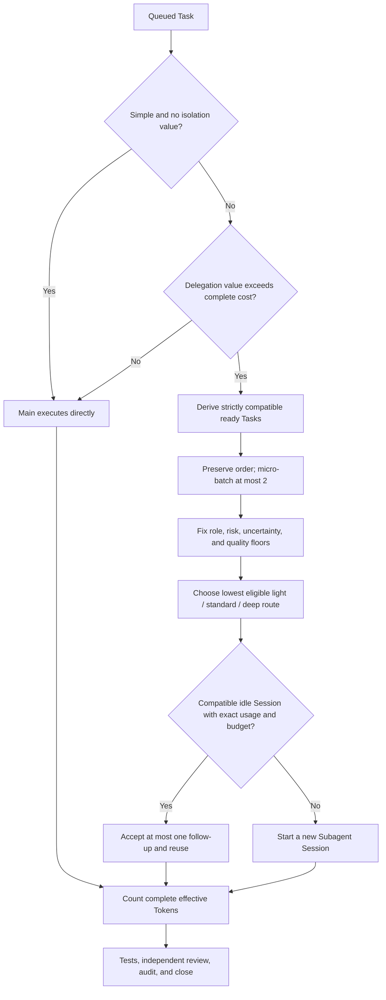

# Cached Subagent Harness 🧭

Standalone, long-running Token-aware control plane for subagents in agentic
CLIs. This repository packages the `cached-subagent-harness` Skill plus a
compact Rust `harnessctl` runtime for task batching, quality-constrained model
routing, bounded Session reuse, stable dispatch prompts, SQLite lifecycle
state, a read-only results Dashboard, and final audits.

Standalone is the default. The built-in method owns planning, bounded work,
test-first behavior changes, review, verification, and lifecycle audit without
requiring an external methodology.

The core objective is to reduce total effective Token use without weakening
development or review quality. Visualization is required, but it is a
supporting evidence surface rather than a second control plane.

The current policy prevents known high-cost Session regressions. It does not
claim positive end-to-end Token savings: the retained equal-quality live A/B
runs remain negative, while offline prompt-shape benchmarks are regression
signals rather than billing evidence.

## Current Status

The lightweight runtime and results Dashboard are implemented. The release
gates cover Rust/Python tests, Clippy, release validation, both offline
Benchmark suites, lifecycle audit, and independent review.

Two real Signal Sweep A/B runs are deliberately retained as negative evidence.
The original one-Session/three-follow-up arm cost `5.90×` Baseline. Its proposed
replacement—one four-slice Session—still cost `5,053,165` effective Tokens
against a fresh `2,642,029` Baseline (`1.91×`, or `-91.26%` saving) before
counting `659,823` retry Tokens. The release therefore uses strictly compatible
micro-batches of at most two assignments by default and makes no positive live
Token-saving claim for batching or reuse.

See [Current Product State](docs/current-state.md) for the canonical behavior,
terminology, evidence boundary, and document map.

## Why This Exists 🔍

Subagents are useful, but unmanaged subagents get expensive and messy quickly:

- each worker receives a large repeated handoff;
- prompt-cache hits become accidental instead of designed;
- lifecycle state lives in chat history instead of a durable report;
- finished agents stay open and keep counting against concurrency limits;
- write scopes are unclear, so parallel work can collide;
- the controller cannot easily audit whether workers actually reported,
  verified, and closed.

This harness treats subagents as a controlled workflow, not just extra chat
tabs. It makes the controller keep a stable prompt contract, pass dynamic
context by path, record lifecycle state in a ledger, and verify gates before
claiming completion.

## Design Principles 🧱

- 🧩 **Problem first**: every worker brief starts with Problem, Scenarios,
  Options, and Chosen Plan before code changes.
- 🪪 **Stable identity, dynamic tail**: reusable rules stay in a stable prompt
  prefix; task-specific paths and values stay after `--- DYNAMIC TASK CONTEXT ---`.
- 📦 **Evidence-bounded micro-batches**: known compatible ready work is
  partitioned into batches of at most two assignments before reuse. Profile,
  risk, scope, revision, dependency, and review boundaries are never weakened
  to make a batch.
- 🧠 **Quality-constrained routing**: choose the lowest `light`, `standard`, or
  `deep` profile that still satisfies role, risk, uncertainty, and quality
  floors.
- 📉 **Cache-aware, not magic**: the harness is valuable when repeated dispatches
  can reuse the stable prefix. It is not guaranteed to reduce raw tokens for
  tiny one-agent tasks.
- 🧮 **Complete cost**: retry, escalation, review, and fixer Tokens count along
  with bootstrap, context, and useful work.
- 🧾 **Durable lifecycle**: Runs, Tasks, Sessions, usage, and activity live in
  compact SQLite state with explicit assignments, reports, requested/actual
  models, terminal reasons, and audit rules.
- 🔐 **Explicit write scope**: worker prompts require `ALLOWED_WRITE_PATHS`;
  discussion, explorer, and reviewer roles remain read-only.
- 🔁 **Loop before drift**: if exploration, tests, or review invalidate the
  plan, update the brief/report and return to the earliest invalid gate.
- ✅ **Complete development**: tests, review, verification, docs, cleanup, and
  final audit are part of the work, not optional follow-up.
- 🪟 **Facts, not observer guesses**: terminal status and the Dashboard use the
  same limited status projection from durable state. Missing telemetry stays
  unknown.

## How It Works ⚙️

1. **Controller frames the work** with PSOC: Problem, Scenarios, Options, Chosen
   Plan.
2. **Controller creates durable state**: report path, lifecycle ledger, agent
   budget, and write scopes.
3. **`harnessctl bundle` and `decide` select the execution shape**: main,
   evidence-bounded micro-batch, compatible reuse, or a new Session. The bundle
   default is two assignments and runtime flags may only lower it. Model
   routing happens only after safety floors are fixed.
4. **`harnessctl render-prompt` generates dispatch prompts** with a stable
   prefix and a small dynamic tail.
5. **Subagents work inside role gates**:
   - `explorer`: read-only context gathering;
   - `discussion`: product or architecture discussion, read-only;
   - `worker`: bounded writes only inside `ALLOWED_WRITE_PATHS`;
   - `reviewer`: read-only review against brief, report, and diff;
   - `fixer`: one batched fix pass for review findings.
6. **Status, watch, and Dashboard read the same facts** without controlling the
   host or inventing progress.
7. **`harnessctl audit` checks lifecycle state** before final completion.
8. **Controller closes superseded agents** and records any failed, abandoned, or
   externally unknown agents with explicit reasons.

## When To Use It 🚦

Use this harness when the task has one or more of these properties:

- multiple subagents or repeated worker dispatches;
- long task briefs that would otherwise be pasted into every worker prompt;
- strict write boundaries across parallel workers;
- compatible ready work can be combined into one bounded package;
- task complexity and risk justify different model capability profiles;
- lifecycle cleanup matters because open agents consume budget;
- the task needs durable status across resumes or context compaction;
- you want a reviewer/fixer gate before claiming completion.

It is usually not worth it for a single small edit, a one-off question, or a task
where prompt-cache behavior is irrelevant.

## What It Adds 📦

- Stable prompt prefixes with dynamic task context at the tail.
- Strictly compatible micro-batching, at most two Tasks by default, before
  Session continuation.
- `light`, `standard`, and `deep` routing with explicit safety floors.
- One accepted follow-up and 200,000 effective Tokens as conservative default
  Session reuse limits; command-line overrides may only lower them.
- Problem, Scenarios, Options, Chosen Plan before worker code.
- Read-heavy parallelism and write-heavy serialized gates.
- Explicit `ALLOWED_WRITE_PATHS` for writer roles.
- SQLite-backed agent lifecycle ledgers.
- Bilingual, loopback-by-default embedded results Dashboard.
- Final audit enforcement before claiming completion.
- Rust CLI checks for prompt shape, budget, and open agents.

## Run, Task, Subagent, and Session

These terms describe different parts of execution:

- **Run**: one Harness-controlled goal and its complete audit boundary. It owns
  Tasks, Sessions, usage, activity, and a final status.
- **Task**: one durable unit of work inside a Run. Tasks move through `queued`,
  `running`, `reported`, and `accepted`, or a truthful blocked/failed state.
- **Subagent**: the delegated logical executor or role that performs work, such
  as an explorer, worker, reviewer, or fixer.
- **Session**: the concrete resumable host CLI/model context that carries one
  Subagent instance plus its Harness lifecycle record.

A new delegated Session normally creates a new Subagent instance. One Session
can let that instance carry several compatible Tasks sequentially, but it can
be busy with only one current Task at a time. Session is not an account login,
authentication state, or Task, and a visible host tab is not proof that the
Session remains reusable. Reuse requires exact compatibility, durable
follow-up acceptance, and complete exact assignment usage strictly after the
acceptance boundary. Unknown telemetry closes the reuse path.

The runtime deliberately has no duplicate Subagent table. A Session already
records the executor's role, host, requested/actual model, lifecycle state,
current Task, and ordered Task chain. The Dashboard therefore calls these
records **Subagent sessions** while keeping Session as the durable lifecycle
term.

## Token Decision Flow

The Harness optimizes only after preserving development and review quality:



Complete effective cost includes bootstrap, context, useful work, retry,
escalation, review, and fixer Tokens. The release defaults remain at most two
strictly compatible Tasks per micro-batch, one accepted follow-up, and 200,000
effective Tokens for reuse eligibility. Runtime flags may only lower these
limits. The retained real A/B evidence is negative, so this flow is a
conservative strategy—not a claim that batching or reuse always saves Tokens.

## Install

Standalone is the default installation mode. The installer reads the
exact checked-out version and downloads that version's platform archive. It
verifies the bytes against `SHA256SUMS`, validates the archive shape, and
atomically installs `harnessctl`. It never follows an unbounded `latest`
release.

### Prebuilt binary (recommended)

On Linux, macOS, or WSL, check out the release and run the Bash installer:

```bash
git clone --branch v0.2.0 --depth 1 \
  https://github.com/kailiangshang/cached-subagent-harness
cd cached-subagent-harness
scripts/install.sh --binary-source auto
```

On native Windows PowerShell 7:

```powershell
git clone --branch v0.2.0 --depth 1 `
  https://github.com/kailiangshang/cached-subagent-harness
Set-Location cached-subagent-harness
pwsh -NoProfile -File scripts/install.ps1 -BinarySource Auto
```

`auto` is the default on both platforms: it tries the verified prebuilt binary
first and falls back to a locked Cargo build only when acquisition fails. The
Skill copy is preserved if runtime acquisition ultimately fails.

The five prebuilt targets are:

| Platform | Rust target | Archive |
|---|---|---|
| Linux x86-64 | `x86_64-unknown-linux-gnu` | `.tar.gz` |
| Linux ARM64 | `aarch64-unknown-linux-gnu` | `.tar.gz` |
| macOS Intel | `x86_64-apple-darwin` | `.tar.gz` |
| macOS Apple Silicon | `aarch64-apple-darwin` | `.tar.gz` |
| Windows x86-64 | `x86_64-pc-windows-msvc` | `.zip` |

The `v0.2.0` native compatibility claim is intentionally narrow: Linux is
built and executed on Ubuntu 24.04 / glibc 2.39, macOS on macOS 15, and Windows
on GitHub's current `windows-latest` x86-64 runner.
Older operating-system releases are not certified in this version.
A matching architecture is not by itself a minimum-OS guarantee; `auto` enters
the locked Cargo fallback if the downloaded runtime cannot be acquired, and
users can select `build` directly.

SHA-256 confirms that downloaded bytes match the published manifest, but the
binaries are currently unsigned: this release does not provide Apple
notarization, Windows Authenticode, or another platform trust signature.

### Binary source policy

Use `--binary-source auto|download|build|none` with `scripts/install.sh`, or
`-BinarySource Auto|Download|Build|None` with `scripts/install.ps1`:

| Source | Behavior |
|---|---|
| `auto` | Verified exact-version download, then locked Cargo fallback |
| `download` | Verified download or a nonzero failure; never builds |
| `build` | Locked Cargo build only; never downloads |
| `none` | Installs the Skill without a runtime and reports that boundary |

`--skip-build` remains a deprecated Bash alias for `--binary-source none`.

### Source build fallback

To deliberately compile instead of downloading, install Rust/Cargo and run:

```bash
scripts/install.sh --binary-source build
```

```powershell
pwsh -NoProfile -File scripts/install.ps1 -BinarySource Build
```

Both paths use Cargo's locked dependency graph. You can also build the
repository runtime directly with `scripts/build-harnessctl.sh`.

The installers target a Codex-compatible Skill directory. Claude Code,
OpenCode, and other runtimes with a compatible Skill interface can use the same
Skill folder, but runtime-specific discovery paths and lifecycle capabilities
remain the host's responsibility.

Use a custom Codex home:

```bash
scripts/install.sh --codex-home /path/to/.codex
```

```powershell
pwsh -NoProfile -File scripts/install.ps1 -CodexHome C:\path\to\.codex
```

Replace an existing local install:

```bash
scripts/install.sh --force
```

The legacy `--skip-superpowers` flag remains accepted as a deprecated no-op for
compatibility. Standalone is already the default:

```bash
scripts/install.sh --skip-superpowers
```

After install, restart your CLI runtime so the new skill is loaded.

### Optional methodology integration

Enable Superpowers explicitly in the same standalone-first installer run:

```bash
scripts/install.sh --with-superpowers
```

Pin the optional clone to a branch, tag, or commit with `SUPERPOWERS_REF`:

```bash
SUPERPOWERS_REF=v6.0.3 scripts/install.sh --with-superpowers
```

An explicitly requested integration failure returns nonzero while leaving the
standalone core installed. Missing optional methodology is normal and does not
degrade the harness.

See [docs/superpowers.md](docs/superpowers.md) for optional integration details.

## Host Support

`harnessctl host-command` ships command templates for Codex, Claude Code, and
OpenCode. A template maps `spawn`, optional `followup`, optional `close`, and
the three model profiles to a host's native argument array.

```bash
skills/cached-subagent-harness/scripts/bin/harnessctl host-command \
  --host codex \
  --operation spawn \
  --profile standard \
  --model MODEL \
  --prompt "PROMPT"
```

The command prints a JSON argument array; it does not evaluate a shell command
or invoke the host. The controller uses the host's native agent/session
mechanism and records requested versus observed behavior separately.

Other CLI or desktop runtimes do not need a scanner, bridge, or adapter class.
If they expose equivalent Skill and agent commands, add a compatible JSON
template and pass it with `--templates FILE`. Use the bundled
[`host-templates.json`](skills/cached-subagent-harness/references/host-templates.json)
as the schema example. This is a configuration extension, not a claim that
every host has passed a live compatibility test.

## Verify

Run the repository verification:

```bash
scripts/verify.sh
```

This validates plugin metadata, the standalone invariant constitution,
installer behavior, and public documentation; runs Rust formatting, tests, and
optional clippy; builds `harnessctl`; runs both benchmark suites; and exercises
prompt plus ledger smoke tests.

GitHub Actions runs the same release verification on push and pull request.

## Quick Start

Build the runtime, initialize one Run, and inspect its durable state:

```bash
scripts/build-harnessctl.sh
mkdir -p .agent-harness

HARNESSCTL=skills/cached-subagent-harness/scripts/bin/harnessctl
DB=.agent-harness/example.sqlite3
RUN=example-run

"$HARNESSCTL" init \
  --db "$DB" \
  --run "$RUN" \
  --goal "Coordinate a bounded development task" \
  --repo-root "$PWD" \
  --report results-example.md

"$HARNESSCTL" status --db "$DB" --run "$RUN"
```

The controller then records Tasks before dispatch, calls `bundle` and `decide`,
renders a bounded prompt, invokes the selected host through its native
interface, records the observed Session and usage, and runs `audit` before
completion. Run `harnessctl` with no arguments for the compact command synopsis.

## Dashboard

Start the embedded results view for one Harness Run:

```bash
skills/cached-subagent-harness/scripts/bin/harnessctl dashboard \
  --db .agent-harness/example.sqlite3 \
  --run example-run \
  --bind 127.0.0.1 \
  --port 7347 \
  --lang zh-CN
```

Open `http://127.0.0.1:7347`. The Moonlight Indigo liquid-glass page supports
zh-CN and en-US and shows progress, Tasks, Subagent Session chains,
requested/actual models, current routing and release limits, the static Token
decision policy, token quality, phase totals, and factual activity summaries.
CLI JSON and the Web
page use the same limited `StatusView`. It structurally excludes `repo_root`,
`report_path`, `write_scope`, Host handles, and task-internal next actions.
Run goals, Task titles, and activity summaries are caller-provided display text
and are not sanitized; do not place prompts, secrets, sensitive paths, source
content, or long logs in those fields.

The Dashboard displays only Harness results. Baseline comparisons and A/B
experiments belong in separate Benchmark evidence and are never served as
product UI. It binds to loopback by default; non-loopback binding requires an
explicit `--allow-remote true` opt-in. The embedded server has no authentication
or TLS. Keep it on loopback, or expose it only through a trusted,
access-controlled network or tunnel.

## Benchmarks 📊

This repo has two benchmark layers.

The benchmark design intentionally separates three different claims:

- **Raw prompt estimate**: how many prompt bytes are generated before provider
  prompt-cache effects.
- **Cache-adjusted estimate**: the stable harness prefix is counted once, while
  each dynamic tail is counted per dispatch.
- **Runtime observation**: real status and token telemetry from an actual
  agentic CLI run.

Only runtime observations can prove end-to-end savings for a specific model,
CLI, cache policy, and task. The offline benchmarks are regression tests and
planning signals.

### Real Signal Sweep Evidence

Two completed 2026-07-15 Codex CLI runs produced equal-quality implementations
with exact telemetry. Both candidate context-reuse strategies were more
expensive than fresh narrow Sessions:

| Experiment | Baseline | Harness sample | Relative cost | Saving |
|---|---:|---:|---:|---:|
| Repeated follow-ups | 2,974,064 | 17,551,878 | 5.90× | -490.16% |
| Four-slice large batch, comparable sample | 2,642,029 | 5,053,165 | 1.91× | -91.26% |
| Large batch, retries included | 2,642,029 | 5,712,988 | 2.16× | -116.23% |

This rejects the old rule “resume the same Session for every compatible later
assignment.” High cache-hit rates did not offset cumulative resumed context.
The current policy partitions strictly compatible work into micro-batches of at
most two, defaults to at most one accepted later follow-up and 200,000 effective
Tokens per reusable Session, and requires exact causal usage before reuse.
Larger limits require versioned equal-quality exact-usage evidence.

See the [corrected large-batch evidence](docs/benchmarks/2026-07-15-signal-sweep-corrected-ab.md)
and the [historical follow-up evidence](docs/benchmarks/2026-07-15-signal-sweep-real-ab.md).

### Prompt-shape Regression

```bash
scripts/build-harnessctl.sh
python3 scripts/token_effectiveness_task.py --format markdown
```

This low-cost CI task compares a baseline embedded handoff against the cached
harness handoff for repeated worker dispatches. The representative task is a
feedback-agent / inspection-platform refactor brief with PSOC, read-only source
constraints, future workflow needs, and explicit write scopes.

The estimator is a deterministic `bytes/4` proxy. It is meant to prove prompt
shape and regressions in CI; it is not provider billing telemetry. Raw prompt
size is informational because a stronger stable prefix can make a compact
single prompt larger while improving cache-adjusted cost.

Current checked-in fixture result with 4 worker dispatches:

| Metric | Baseline embedded handoff | Cached harness handoff |
|---|---:|---:|
| Estimated tokens total | 1784 | 2164 |
| Cache-adjusted estimated tokens | n/a | 856 |
| Stable prefix ratio | n/a | 80.59% |
| Repeated cacheable tokens | n/a | 1308 |

Raw estimated savings is `-21.3%` because the stable safety prefix is larger.
Cache-adjusted estimated savings is `52.02%`, which is the CI gate that matters.

This result does not prove unconditional token savings. It proves that repeated
worker dispatches keep reusable harness rules cacheable and dynamic tails small.

See [docs/token-effectiveness-task.md](docs/token-effectiveness-task.md) for the
task fixture, comparison method, and limits.

### Game-development A/B Protocol

```bash
scripts/build-harnessctl.sh
python3 scripts/game_dev_ab_benchmark.py --format markdown
```

This stronger benchmark generates equivalent worker prompts for a small browser
game development task in two modes:

- baseline: each worker receives a self-contained embedded handoff;
- cached harness: each worker receives the stable harness prefix plus dynamic
  paths to a shared brief and lifecycle ledger.

Latest local offline estimate with 4 workers:

| Metric | Baseline embedded handoff | Cached harness handoff |
|---|---:|---:|
| Estimated tokens total | 3727 | 2232 |
| Cache-adjusted estimated tokens | 3727 | 852 |
| Stable prefix ratio | n/a | 82.44% |

Raw estimated savings is `40.11%`; cache-adjusted estimated savings is `77.14%`.

The key difference from the prompt-shape fixture is that the game workload has a
larger realistic brief and four independent worker slices. The values still
measure generated prompt shape, not the growing model context observed across a
resumed Session.

Generate artifacts for a real A/B run:

```bash
python3 scripts/game_dev_ab_benchmark.py \
  --output-dir /tmp/game-dev-ab \
  --output /tmp/game-dev-ab/report.json \
  --format json
```

The generated observation template can ingest real status and token telemetry
from two actual agent runs. Without observations, the report marks runtime
status as `not-observed`.

See [docs/game-dev-ab-benchmark.md](docs/game-dev-ab-benchmark.md) for the
status schema, quality gates, and interpretation.

## Rust Tool

Build only the Rust harness binary:

```bash
scripts/build-harnessctl.sh
```

The runtime binary is written to:

```text
skills/cached-subagent-harness/scripts/bin/harnessctl
```

The binary is not committed because it is platform-specific. The source lives in:

```text
skills/cached-subagent-harness/scripts/harnessctl
```

Public releases provide a verified five-target binary matrix. Building from
source with locked Cargo remains the explicit fallback; platform binaries are
not committed into the Skill directory.

## Usage

Invoke the skill in a supported CLI runtime:

```text
Use cached-subagent-harness to coordinate this long-running development task.
```

For direct CLI checks:

```bash
skills/cached-subagent-harness/scripts/bin/harnessctl --help
```

## License

MIT
