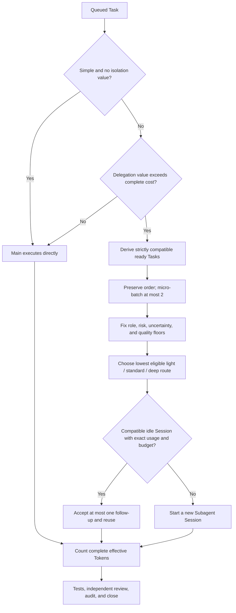

# Current Product State

Date: 2026-07-16

Status: `v0.2.0` is published and accepted with verified five-target binary
distribution, Bash and native PowerShell installation, a successful tag-gated
GitHub Release workflow, and downloaded-binary checksum/execution evidence

This is the shortest current-state entry point for `cached-subagent-harness`.
It summarizes the implemented product and points to the binding contracts and
retained evidence. Completed plans, review transcripts, implementation reports,
and superseded designs remain available through Git history rather than the
current product documentation tree.

## Product Priority

The Harness optimizes one objective:

> Minimize total effective Token use while preserving complete development and
> review quality.

The product is a long-running Token-aware control plane. Its measured value
includes durable recovery and prevention of known high-cost Session
regressions; it does not claim positive end-to-end Token savings while retained
equal-quality live comparisons remain negative.

The Dashboard is mandatory because users need to see work, Sessions, quality,
and cost. It is still a supporting read-only view, not a second controller and
not the primary product objective.

The 20 numbered invariants in
[`SKILL.md`](../skills/cached-subagent-harness/SKILL.md) remain the constitution.
They preserve PSOC, bounded writes, durable lifecycle state, independent
review, complete-development gates, truthful unknowns, stable prompts, safe
routing, and final audit.

## Implemented Architecture

The product has four compact layers:

1. **Skill policy** defines controller behavior, role gates, prompt discipline,
   Token strategy, and completion requirements.
2. **`harnessctl`** stores current Run, Task, Session, usage, and activity state
   in SQLite. Focused Rust modules handle bundling, routing, Session decisions,
   host command templates, accounting, status, and the embedded Web server.
3. **Presentation** exposes terminal status, JSON, watch mode, and one
   bilingual single-Run Dashboard from the same limited status projection.
4. **Distribution** packages five versioned native binaries, publishes an exact
   `SHA256SUMS` manifest, and installs the matching verified runtime through
   Bash or PowerShell with an explicit locked Cargo fallback.

Current-state tables are authoritative. The small activity feed is useful for
display and debugging but is never replayed to reconstruct state. There is no
event-sourced platform, capability scanner, desktop bridge, permanent observer,
Node service, or frontend framework.

Standalone is normal operation. Superpowers is an explicitly optional,
phase-lazy methodology integration; its absence is not degraded mode.

## Token Strategy

The controller applies this order:

Compatibility includes role, required profile, risk, package, write scope,
repository revision, dependency order, and review boundary. The ready set is
derived from durable queued Tasks rather than a caller-provided count.

Known compatible work is partitioned into micro-batches before Session reuse.
The release default is at most two assignments per batch. The controller may
not normalize role, profile, risk, scope, revision, dependency order, or review
boundary to manufacture compatibility. A reusable Session defaults to at most
one accepted follow-up and 200,000 total effective Tokens. Runtime flags may
lower any of these values but cannot raise them; increases require versioned
equal-quality exact-usage evidence. Reuse additionally requires:

- an exact compatibility signature and atomic `idle` to `busy` claim;
- durable acceptance of the current follow-up;
- complete exact normalized usage linked to the same Run, Task, and Session;
- usage strictly after the acceptance transaction's causal boundary;
- remaining follow-up and effective-Token budgets.

Unknown, partial, stale, non-normalizable, or mismatched usage ends the reuse
path. Busy Sessions own exactly one current Task; idle and terminal Sessions
own none.

Model routing is quality-constrained. The required profile is the maximum of
role, risk, complexity, and uncertainty floors. `light` serves bounded
read-only or formatting work, `standard` serves scoped implementation and
ordinary analysis, and `deep` serves architecture, ambiguous multi-step work,
control-plane changes, security-sensitive work, and high-risk review. Cost is
optimized only after those floors are fixed.

Accounting includes bootstrap, context, work, retry, escalation, review, and
fixer phases. Missing values remain unknown. Estimates disclose method,
eligible sample count, and quality; cross-provider monetary savings remain
unsupported without explicit compatible price data.

## Run, Task, Subagent, and Session

| Object | Meaning | Important boundary |
|---|---|---|
| Run | One Harness-controlled goal and final-audit scope | Owns all Tasks, Sessions, usage, and activity for that effort |
| Task | One durable unit of work | Has status, compatibility facts, assignment, and acceptance; detailed evidence lives in the Run-level external report |
| Subagent | The delegated logical executor or role that performs work | Represented by its role and execution facts; it is not a second lifecycle ledger |
| Session | The concrete resumable host CLI/model context that carries one Subagent instance | May carry compatible Tasks sequentially; never carries two current Tasks |

Subagent is the delegated logical executor or role. Session is the concrete
host CLI/model context and lifecycle record. A new delegated Session normally
creates a new Subagent instance; one compatible Session may let it execute
several Tasks sequentially. Session is not an account login, browser
authentication state, or Task: a Task is work, while a Session is the host
context that may perform it. A Session visible in a host UI is not automatically
open or reusable in Harness state.

The compact runtime deliberately does not persist a duplicate Subagent table.
The Session already carries role, host, requested and actual model, status,
current Task, and the ordered Task chain. User-facing presentation calls these
records **Subagent sessions** to make the logical executor visible without
creating two lifecycle sources of truth.

## Host Boundary

Bundled command templates cover Codex, Claude Code, and OpenCode. They render
native argument arrays for spawn and supported follow-up/close operations.
`harnessctl` does not run those arrays through a shell or claim an observed
result from a requested command; the controller invokes the host and records
actual behavior separately.

Compatible runtimes such as desktop agents can be added with a JSON template
when they expose equivalent Skill and agent/session commands. This needs no
scanner, bridge, or adapter framework. A custom template proves configuration
compatibility, not live certification. The Bash and PowerShell installers
target a Codex-compatible Skill directory; other runtimes use their own
discovery path.

## Dashboard Boundary

The embedded Dashboard is a dense Moonlight Indigo liquid-glass results view.
It supports zh-CN and en-US, larger operational type, responsive layouts,
reduced motion/transparency, and loopback binding by default.

It shows only Harness facts for one Run:

- progress and factual Run freshness;
- the active dispatch-policy limits and latest factual route decision;
- Task states, package grouping, current work, and latest activity;
- Subagent Session host/role/profile/model facts and ordered assignment chains;
- a static release-policy map, explicitly separated from the latest observed
  route and current Run data;
- exact or explicitly qualified Token totals and phase composition;
- reuse, churn, assignments per spawn, estimate method, sample count, and
  quality.

The limited projection structurally excludes `repo_root`, `report_path`,
`write_scope`, Host handles, and task-internal next actions. Run goals, Task
titles, and activity summaries are caller-provided display text and are not
sanitized. Controllers must keep prompts, secrets, sensitive paths, source
content, and long logs out of those fields.

The Dashboard never contains Baseline columns, A/B controls, benchmark
branding, observer guesses, or billing claims. The embedded server has no
authentication or TLS. Keep the default loopback binding; a non-loopback bind
requires explicit `--allow-remote true` and is suitable only behind a trusted,
access-controlled network or tunnel.

## Evidence and Claim Boundary

Offline fixtures verify prompt shape and cacheability but do not prove provider
billing savings. Two real 2026-07-15 Signal Sweep experiments compared
equal-quality Codex CLI runs with exact telemetry:

| Experiment | Baseline | Harness sample | Relative cost | Saving |
|---|---:|---:|---:|---:|
| Repeated follow-ups | 2,974,064 | 17,551,878 | 5.90× | -490.16% |
| Four-slice large batch, comparable sample | 2,642,029 | 5,053,165 | 1.91× | -91.26% |
| Large batch, retries included | 2,642,029 | 5,712,988 | 2.16× | -116.23% |

The first result rejected unlimited continuation. The second rejected the
assumption that all ready work should share one long turn: repeatedly processing
the growing tool/code context doubled cached input even with zero follow-ups.
Together they justify the default two-assignment micro-batch, one-follow-up,
200,000-Token policy and strict causal usage gate. The release makes no positive
live Token-saving claim for batching or reuse.

## Verification State

The published `v0.2.0` source passed fresh local verification on 2026-07-16:

- Rust tests: 52/52;
- Python tests: 71/71 across Bash installation, standalone contracts, release
  distribution/workflow contracts, Token effectiveness, and game A/B;
- release metadata/tag equality, deterministic archive generation, checksum
  exactness, YAML parsing, Clippy with warnings denied, and a release build;
- both offline Benchmark gates, prompt/ledger smoke, and all 20 Skill
  invariants.

The native PowerShell behavior suite passed feature-branch CI run
[`29484406668`](https://github.com/kailiangshang/cached-subagent-harness/actions/runs/29484406668)
at exact source `bf45aae`, including production loopback HTTP acquisition and
failure-safe replacement. Independent release/security review found no Critical
issue; after two bounded fix/re-review cycles, the final review reported no open
Critical or Important finding. Main CI run
[`29485169389`](https://github.com/kailiangshang/cached-subagent-harness/actions/runs/29485169389)
then passed Linux verification and native Windows behavior at release source
`0349449`.

Annotated tag `v0.2.0` and the public
[`v0.2.0` Release](https://github.com/kailiangshang/cached-subagent-harness/releases/tag/v0.2.0)
both resolve to `0349449383c31f186eb26dac7081c0cf15f52401`. Release run
[`29485571155`](https://github.com/kailiangshang/cached-subagent-harness/actions/runs/29485571155)
passed full verification, five native builds, and publication. The Release has
exactly the five documented platform archives plus `SHA256SUMS`. A fresh public
download of the 1,688,956-byte Linux x86-64 archive matched checksum
`79b8365e71056cfcd6b3f385f6eec35b8dc54e16a66b0d01c0b2b906acbe4f47`,
contained only regular `harnessctl` and `LICENSE` members, and executed
`harnessctl --help`. The retained acceptance boundary is documented in the
[`v0.2.0` release notes](releases/0.2.0.md) and the
[`binary release design`](specs/2026-07-16-binary-release-design.md).

## Document Authority

| Document | Current role |
|---|---|
| [`README.md`](../README.md) | Product overview, quick start, installation, and primary navigation |
| [`SKILL.md`](../skills/cached-subagent-harness/SKILL.md) | Binding controller constitution and workflow |
| This current-state record | Implemented architecture, measured claim boundary, and verification state |
| [`v0.2.0 release notes`](releases/0.2.0.md) | User-facing assets, installers, compatibility, evidence, and security boundary |
| [`v0.2.0 binary release design`](specs/2026-07-16-binary-release-design.md) | Implemented distribution and installer architecture |
| [`2026-07-16 Subagent Session strategy`](specs/2026-07-16-subagent-session-token-strategy-design.md) | Implemented four-term model, Token decision order, and presentation boundary |
| [`2026-07-14 lightweight design`](specs/2026-07-14-lightweight-token-harness-design.md) | Canonical lightweight architecture, amended by retained live evidence |
| [`2026-07-15 Dashboard design`](specs/2026-07-15-results-dashboard-design.md) | Implemented presentation and validation boundary |
| [`Corrected Signal Sweep evidence`](benchmarks/2026-07-15-signal-sweep-corrected-ab.md) | Exact large-batch RED result and current policy correction |
| [`Historical Signal Sweep evidence`](benchmarks/2026-07-15-signal-sweep-real-ab.md) | Exact repeated-follow-up RED result |
| [`Game-development A/B protocol`](game-dev-ab-benchmark.md) and [`Token-effectiveness task`](token-effectiveness-task.md) | Reproducible benchmark protocols and acceptance rules |
| [`Optional Superpowers integration`](superpowers.md) | Phase-lazy optional methodology boundary |
| [`Gates`](../skills/cached-subagent-harness/references/gates.md), [`prompt layering`](../skills/cached-subagent-harness/references/prompt-layering.md), [`report contracts`](../skills/cached-subagent-harness/references/report-contracts.md), and [`standalone methodology`](../skills/cached-subagent-harness/references/standalone-methodology.md) | Operational references loaded by the Skill when relevant |

Historical process records and superseded designs remain reachable through Git
history. They do not govern the current product; the current Skill, retained
designs, runtime gates, release notes, and retained evidence do.
