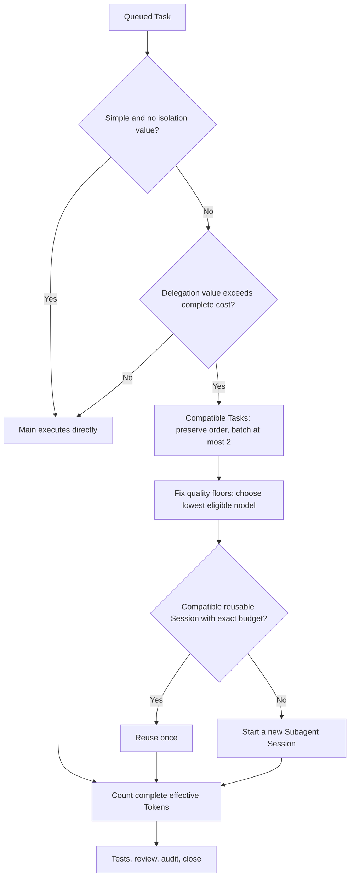

# Subagent Session Token Strategy Implementation Plan

> **For agentic workers:** REQUIRED SUB-SKILL: Use
> `subagent-driven-development` or `executing-plans` to implement this plan
> task-by-task. Steps use checkbox (`- [ ]`) syntax for tracking.

**Goal:** Explain Subagent, Session, Task, and the complete Token optimization
flow consistently in the Skill, public documentation, and bilingual Dashboard.

**Architecture:** Keep the existing Run/Task/Session SQLite model and limited
`StatusView`. Treat Subagent as the logical delegated executor represented by a
Session's role and host facts, add no duplicate persistence, and render a static
release-policy map with native HTML/CSS beside the existing live state.

**Tech Stack:** Markdown, Python `unittest`, Rust unit tests, embedded HTML/CSS,
vanilla JavaScript, SQLite-backed `harnessctl`.

## Global Constraints

- Preserve all 20 numbered Skill invariants and their priority.
- Keep standalone operation normal; do not add a Superpowers dependency.
- Keep maximum release limits at two Tasks per micro-batch, one accepted
  follow-up, and 200,000 effective Tokens; runtime overrides remain lower-only.
- Do not add a Subagent table, Observer LLM, bridge, scanner, framework, remote
  asset, Baseline/A-B product UI, or unsupported Token-saving claim.
- Keep zh-CN/en-US Moonlight Indigo liquid-glass UI, larger readable type,
  compact information density, loopback default, and the existing privacy
  projection.

---

### Task 1: Terminology and documentation contract

**Files:**

- Modify: `scripts/test_standalone_contract.py`
- Modify: `skills/cached-subagent-harness/SKILL.md`
- Modify: `README.md`
- Modify: `docs/current-state.md`
- Modify: `docs/specs/2026-07-15-results-dashboard-design.md`
- Test: `scripts/test_standalone_contract.py`

**Interfaces:**

- Consumes: approved terminology and flow in
  `docs/specs/2026-07-16-subagent-session-token-strategy-design.md`.
- Produces: one public four-term model and Token decision flow used by users,
  future Skill runners, and Dashboard copy.

- [x] **Step 1: Add failing documentation contract tests**

Add tests that normalize whitespace and require:

```python
def test_skill_explains_subagent_task_and_session_boundaries(self) -> None:
    skill = " ".join(self.read(SKILL_PATH).split())
    for required in [
        "Subagent is the delegated logical executor or role",
        "Session is the concrete host CLI/model context",
        "A new delegated Session normally creates a new Subagent instance",
        "Session is not an account login",
    ]:
        self.assertIn(required, skill)

def test_public_docs_explain_execution_model_and_token_flow(self) -> None:
    for relative in ["README.md", "docs/current-state.md"]:
        text = self.read(relative)
        normalized = " ".join(text.split())
        for term in ["Run", "Task", "Subagent", "Session"]:
            self.assertIn(term, text)
        self.assertIn("Session is not an account login", normalized)
        self.assertIn("```mermaid", text)
        self.assertIn("Count complete effective Tokens", text)
```

- [x] **Step 2: Run the focused tests and confirm RED**

Run:

```bash
python3 -m unittest \
  scripts.test_standalone_contract.StandaloneContractTests.test_skill_explains_subagent_task_and_session_boundaries \
  scripts.test_standalone_contract.StandaloneContractTests.test_public_docs_explain_execution_model_and_token_flow -v
```

Expected: FAIL because the existing Skill has no explicit Subagent/Session
mapping and the public current-state entry has no Mermaid decision flow.

- [x] **Step 3: Implement the smallest consistent documentation update**

Add a compact `Run, Task, Subagent, and Session` table and these binding
sentences to the Skill:

```text
Subagent is the delegated logical executor or role. Session is the concrete
host CLI/model context that carries one Subagent instance and its lifecycle
record. A new delegated Session normally creates a new Subagent instance; one
compatible Session may execute several Tasks sequentially. Session is not an
account login, authentication state, or Task.
```

Add the same four-term table to README/current-state and this Mermaid path:



Amend the 2026-07-15 Dashboard design with the implemented terminology and
policy-map boundary; do not rewrite its historical design narrative.

- [x] **Step 4: Run documentation contracts and release validation**

Run:

```bash
python3 -m unittest scripts.test_standalone_contract -v
python3 scripts/validate-release.py .
```

Expected: all tests PASS; validator prints a successful release result.

- [x] **Step 5: Commit the documentation contract**

```bash
git add scripts/test_standalone_contract.py \
  skills/cached-subagent-harness/SKILL.md README.md docs/current-state.md \
  docs/specs/2026-07-15-results-dashboard-design.md
git commit -m "docs: clarify subagent session token flow"
```

### Task 2: Bilingual Dashboard policy map

**Files:**

- Modify: `skills/cached-subagent-harness/scripts/harnessctl/src/dashboard.rs`
- Modify: `skills/cached-subagent-harness/scripts/harnessctl/assets/index.html`
- Modify: `skills/cached-subagent-harness/scripts/harnessctl/assets/app.js`
- Modify: `skills/cached-subagent-harness/scripts/harnessctl/assets/styles.css`
- Test: `skills/cached-subagent-harness/scripts/harnessctl/src/dashboard.rs`

**Interfaces:**

- Consumes: existing `dispatch_policy`, Task, Session, and activity projection;
  no API shape change.
- Produces: semantic `data-view="strategy-map"`, localized Subagent Session
  title/note, and responsive static policy steps clearly separated from live
  route facts.

- [x] **Step 1: Extend the embedded-asset test and confirm RED**

Require the following markers in
`dashboard_serves_embedded_assets_status_and_security_headers`:

```rust
for marker in [
    "data-view=\"strategy-map\"",
    "id=\"sessions-note\"",
    "id=\"strategy-steps\"",
] {
    assert!(html.contains(marker), "missing {marker}");
}
for copy in [
    "子 Agent 会话",
    "Subagent sessions",
    "Session 是子 Agent 的执行上下文，不是账户登录",
    "A Session is a Subagent execution context, not an account login",
    "releasePolicy",
] {
    assert!(app.contains(copy), "missing {copy}");
}
```

Run:

```bash
cargo test --manifest-path \
  skills/cached-subagent-harness/scripts/harnessctl/Cargo.toml \
  dashboard::tests::dashboard_serves_embedded_assets_status_and_security_headers
```

Expected: FAIL on the first missing marker.

- [x] **Step 2: Add semantic HTML and bilingual copy**

Place the policy map after the live dispatch-policy bar:

```html
<section class="strategy-map glass" data-view="strategy-map"
  aria-labelledby="strategy-title">
  <div class="strategy-heading">
    <p class="section-kicker" data-i18n="releasePolicy">Release policy</p>
    <h2 id="strategy-title" data-i18n="howHarnessWorks">How the Harness works</h2>
    <p data-i18n="policyNotLive">Policy path · not the current Task trace</p>
  </div>
  <ol id="strategy-steps" class="strategy-steps"></ol>
</section>
```

Change the execution heading to `subagentSessions` and add
`<p id="sessions-note" ... data-i18n="sessionDefinition">`. Add matching
zh-CN/en-US dictionary keys for intake, main/delegate, compatible batching,
quality route, Session spawn/reuse, complete cost, and close/audit.

- [x] **Step 3: Render steps without unsafe HTML**

Add `renderStrategy()` that uses the existing `make()`/`textContent` helpers:

```javascript
function renderStrategy() {
  const root = el("strategy-steps");
  clear(root);
  [
    ["01", "strategyIntake", "strategyIntakeNote"],
    ["02", "strategyShape", "strategyShapeNote"],
    ["03", "strategyRoute", "strategyRouteNote"],
    ["04", "strategySession", "strategySessionNote"],
    ["05", "strategyAccount", "strategyAccountNote"]
  ].forEach(([index, title, note]) => {
    const item = make("li", "strategy-step");
    item.append(
      make("span", "strategy-index mono", index),
      make("strong", "", translate(title)),
      make("small", "", translate(note))
    );
    root.appendChild(item);
  });
}
```

Call it from the main `render()` path so a language switch refreshes it.

- [x] **Step 4: Add responsive liquid-glass styling**

Use a five-column desktop flow with connector lines, a two-column tablet flow,
and a single-column compact flow. Keep labels at 11 px or larger, body copy at
12 px or larger, and preserve the existing reduced-motion/transparency
fallbacks. Do not introduce animation required for comprehension.

- [x] **Step 5: Run focused Rust and Python contracts**

Run:

```bash
cargo fmt --manifest-path skills/cached-subagent-harness/scripts/harnessctl/Cargo.toml --check
cargo test --manifest-path skills/cached-subagent-harness/scripts/harnessctl/Cargo.toml dashboard::tests
python3 -m unittest scripts.test_standalone_contract -v
```

Expected: all PASS.

- [x] **Step 6: Commit the Dashboard increment**

```bash
git add skills/cached-subagent-harness/scripts/harnessctl/src/dashboard.rs \
  skills/cached-subagent-harness/scripts/harnessctl/assets/index.html \
  skills/cached-subagent-harness/scripts/harnessctl/assets/app.js \
  skills/cached-subagent-harness/scripts/harnessctl/assets/styles.css
git commit -m "feat: explain subagent execution in dashboard"
```

### Task 3: Validation, visual audit, and delivery closure

**Files:**

- Modify: `docs/current-state.md`
- Modify: `subagent-session-token-strategy-implementation.md`
- Runtime state: `subagent-session-token-strategy-implementation.db` (ignored)

**Interfaces:**

- Consumes: completed documentation/UI contracts and the existing verification
  harness.
- Produces: fresh test evidence, visual audit, independent findings, closed
  lifecycle ledger, final commit, and pushed `origin/main`.

- [x] **Step 1: Build and run full verification**

Run:

```bash
scripts/verify.sh
```

Expected: Rust tests, Python tests, formatting, Clippy/release build when
available, release validation, prompt/cache/benchmark smoke, and lifecycle
audits all PASS.

- [x] **Step 2: Validate the Skill package**

Run the available Skill validator against
`skills/cached-subagent-harness`; if the system validator is not bundled in
this repository, record the successful repository release validator as the
portable equivalent rather than installing or copying the Skill.

- [x] **Step 3: Inspect zh-CN/en-US desktop and compact layouts**

Serve a populated local run on loopback and inspect at least 1440×960 and
390×844. Verify:

```text
no horizontal overflow
policy map is visibly static policy, not live progress
Subagent Session note is readable
Task and Session cards remain the primary live-state surfaces
Chinese and English do not clip
Moonlight Indigo liquid-glass hierarchy remains consistent
```

- [x] **Step 4: Run independent whole-diff review**

Provide the approved design, implementation report, and diff package by path.
Require severity-ordered Critical/Important/Minor findings and fix all Critical
or Important issues in one bounded pass before re-review.

- [x] **Step 5: Update authoritative state and lifecycle audit**

Record exact test counts, visual results, review disposition, changed files,
commits, risks, and no-install boundary. Mark every Harness-created Session
closed, mark the Run complete, then run:

```bash
skills/cached-subagent-harness/scripts/bin/harnessctl audit \
  --db subagent-session-token-strategy-implementation.db \
  --run subagent-session-strategy-20260716
```

Expected: audit PASS with no open Session or unfinished Task.

- [x] **Step 6: Final verification, commit, and push**

Run `git diff --check`, the focused contracts, and `scripts/verify.sh` after any
review fix. Commit the final report/state update, verify a clean worktree, and
push `main` to `origin/main`.
