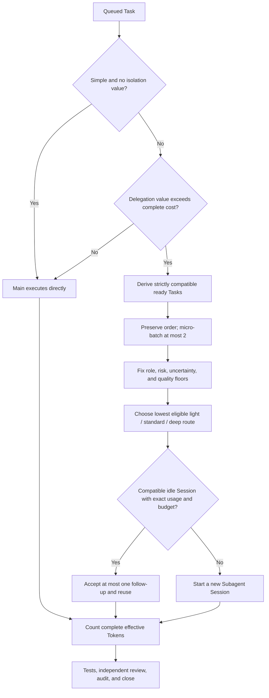

# Subagent, Session, and Token Strategy Design

Date: 2026-07-16

Status: approved for implementation

## Purpose

Make the existing lightweight Harness understandable without adding another
control plane. Documentation and the Dashboard must explain what a Subagent is,
what a Session is, how Tasks move through them, and where Token optimization
actually happens. The 20 numbered Skill invariants, standalone-first operation,
quality gates, conservative release limits, and honest claim boundary remain
unchanged.

## Product Priority

The product continues to optimize one objective:

> Minimize total effective Token use while preserving complete development and
> review quality.

The Dashboard is mandatory, but remains a read-only supporting view. This
increment does not add an observer LLM, browser bridge, desktop scanner,
frontend framework, database table, or host-control API.

## Concept Model

Use these four terms consistently:

| Term | Meaning | Persistence boundary |
|---|---|---|
| Run | One Harness-controlled goal and final-audit scope | Durable Run row |
| Task | One durable unit of work with compatibility, route, assignment, and acceptance state | Durable Task row |
| Subagent | The delegated logical executor or role that performs work | Represented by role and execution facts; no duplicate Subagent table |
| Session | The concrete host CLI/model context and lifecycle record in which a Subagent instance runs | Durable Session row |

The concise user mental model is:

```text
Run
└─ Task
   └─ Subagent (logical executor / role)
      └─ Session (concrete host CLI + model context)
```

The durable ownership model is slightly more precise: a Run owns Tasks and
Sessions; a Task is assigned to at most one current Session; the Session carries
the Subagent role, host, requested/actual model, status, and ordered Task chain.
A new delegated Session normally creates a new Subagent instance. One Session
may let that instance execute several strictly compatible Tasks sequentially,
never concurrently.

`Session` never means account login, browser authentication, or a Task. A host
tab that remains visible is not necessarily reusable: Harness state, exact
usage, compatibility, causal acceptance, and both reuse budgets decide that.

The runtime does not gain a separate Subagent table because it would duplicate
Session identity and create two lifecycle sources of truth. User-facing copy
therefore calls the existing records **Subagent sessions / 子 Agent 会话** and
explains the distinction at the point of use.

## Token Optimization Flow

Apply the decisions in this order:



The flow distinguishes three optimizations:

1. **Avoid delegation when it has no value.** A small Task can stay on main and
   avoid Subagent bootstrap/context cost.
2. **Reduce repeated setup safely.** Known ready work is grouped only when all
   compatibility fields match, in declared order, and in batches of at most two.
3. **Buy only the capability required.** Fix quality and safety floors first,
   then select the lowest eligible model profile. Reuse is a later bounded
   option, not the default.

Complete effective cost includes bootstrap, context, useful work, retry,
escalation, review, and fixer Tokens. Unknown or non-exact usage stays unknown
and closes the reuse path. The release retains a maximum of two Tasks per
micro-batch, one accepted follow-up, and 200,000 effective Tokens for reuse
eligibility. Runtime flags may only lower these limits.

The two retained real A/B experiments remain negative evidence. The UI must not
claim that batching or Session reuse has already demonstrated positive savings.
Benchmark comparisons stay in evidence documents, not the product Dashboard.

## Dashboard Changes

Keep the existing Moonlight Indigo liquid-glass system, bilingual zh-CN/en-US
copy, larger operational typography, dense first viewport, loopback default,
and limited status projection.

Make three focused changes:

1. Rename the Session section to **子 Agent 会话 / Subagent sessions** and add
   one compact note: a Session is the Subagent execution context, not an account
   login. Existing cards continue to show Session ID, host, role, profile,
   requested/actual model, route, current Task or last use, Task chain, status,
   and reuse count.
2. Add a compact **Harness 如何工作 / How the Harness works** policy map below
   the live dispatch-policy bar. It shows Task intake, main/delegate decision,
   compatible batching, quality-constrained routing, Subagent Session
   spawn/reuse, complete Token accounting, and quality/audit closure.
3. Label the map as release policy and keep the existing latest-route field as
   live data. Static policy must never look like the current Task's observed
   path.

Implement the map with semantic HTML and CSS. Do not add Mermaid or another
client dependency to the embedded UI. On compact layouts it becomes a vertical
flow; with reduced motion/transparency it remains fully legible.

## Documentation Changes

- `SKILL.md`: add the four-term execution model and a compact optimization
  decision recipe without changing or renumbering the 20 invariants.
- `README.md`: expand the public concept section to include Subagent and add the
  Mermaid optimization flow.
- `docs/current-state.md`: make the new terminology and flow authoritative.
- `docs/specs/2026-07-15-results-dashboard-design.md`: record the implemented
  terminology and policy-map amendment while retaining its historical scope.
- Dashboard copy: provide matching Chinese and English strings.

## Safety and Information Boundary

The Dashboard still consumes only the existing limited `StatusView`. It does
not expose repository paths, report paths, write scopes, host handles, prompts,
source content, secrets, or Task-internal next actions. Static policy copy is
bundled locally. No new remote resource, write endpoint, authentication claim,
or telemetry inference is introduced.

## Test and Acceptance Contract

Implementation starts with failing contract tests. Acceptance requires:

- all 20 Skill invariants remain present and unchanged in priority;
- Skill, README, and current-state docs define Subagent, Session, Task, and Run
  consistently and state that Session is not account login;
- README and current-state expose a Mermaid Token decision flow;
- Dashboard HTML contains the policy-map and Subagent-session semantic markers;
- both locale dictionaries contain the new headings, definitions, and flow
  labels;
- rendered assets retain text-only DOM insertion and contain no Baseline/A-B UI;
- desktop and compact layouts keep readable hierarchy and do not overflow;
- focused Python/Rust tests, release validation, full verification, independent
  review, and lifecycle audit pass.

## Non-goals

- no new dispatch algorithm or release-limit increase;
- no Observer Agent or LLM-authored progress;
- no independent Subagent persistence model;
- no browser/desktop bridge or capability scanner;
- no installation into or overwrite of the user's active Skill directory;
- no positive Token-saving claim unsupported by equal-quality exact evidence.
